# Mem0 테스트 프로그램 설계 문서

## 1. 프로젝트 개요

Mem0와 Ollama를 통합한 지능형 메모리 기반 대화 시스템입니다. 사용자가 정보를 저장하고, 저장된 컨텍스트를 기반으로 자연스러운 대화를 나눌 수 있는 WebUI 애플리케이션입니다.

### 핵심 기능
- 📝 텍스트 기반 메모리 저장 (mem0)
- 🤖 Ollama 기반 LLM 모델 선택 및 대화
- 💬 저장된 메모리 기반 컨텍스트 응답
- 🌐 직관적인 Web UI (React/Vue)
- ⚡ FastAPI 백엔드 REST API
- 🔍 메모리 검색 및 관리

---

## 2. 시스템 아키텍처

### 2.1 전체 시스템 구조

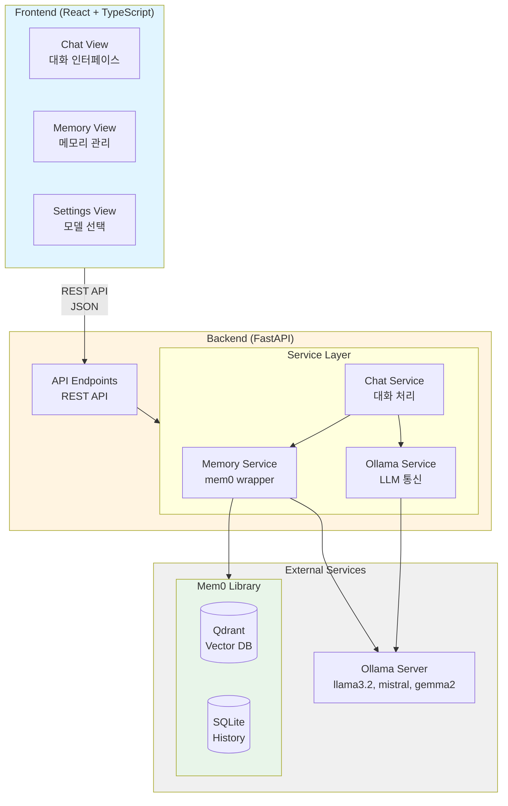

### 2.2 데이터 흐름

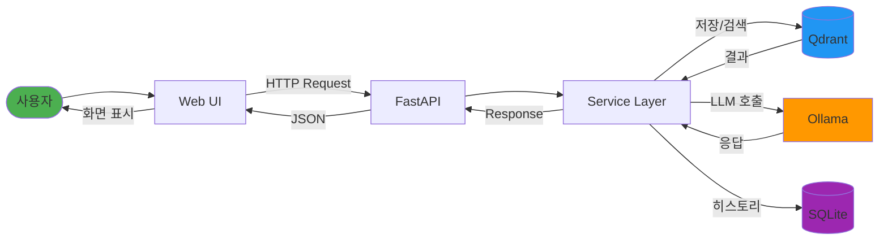

### 2.3 계층별 구조

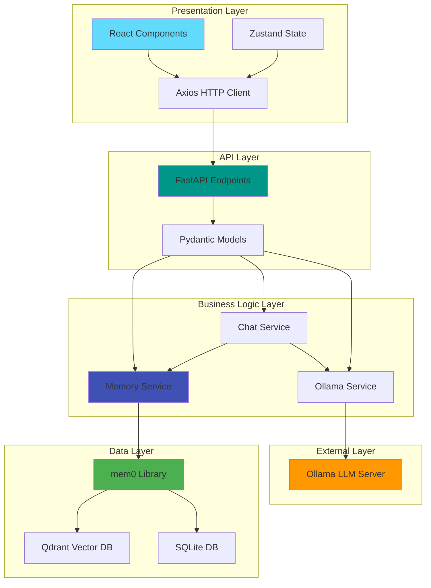

---

## 3. 기술 스택

### Backend
- **Framework**: FastAPI 0.100+
- **Memory Layer**: mem0 (with Ollama integration)
- **Vector DB**: Qdrant (embedded mode)
- **LLM**: Ollama (local)
- **Database**: SQLite (mem0 history)
- **Python**: 3.10+

### Frontend
- **Framework**: React 18+ with TypeScript
- **UI Library**: Tailwind CSS + shadcn/ui
- **State Management**: Zustand
- **HTTP Client**: Axios
- **Build Tool**: Vite

### Infrastructure
- **Containerization**: Docker & Docker Compose
- **Reverse Proxy**: Nginx (optional)
- **CORS**: Enabled for development

---

## 4. 데이터 모델

### 4.0 데이터 모델 관계도

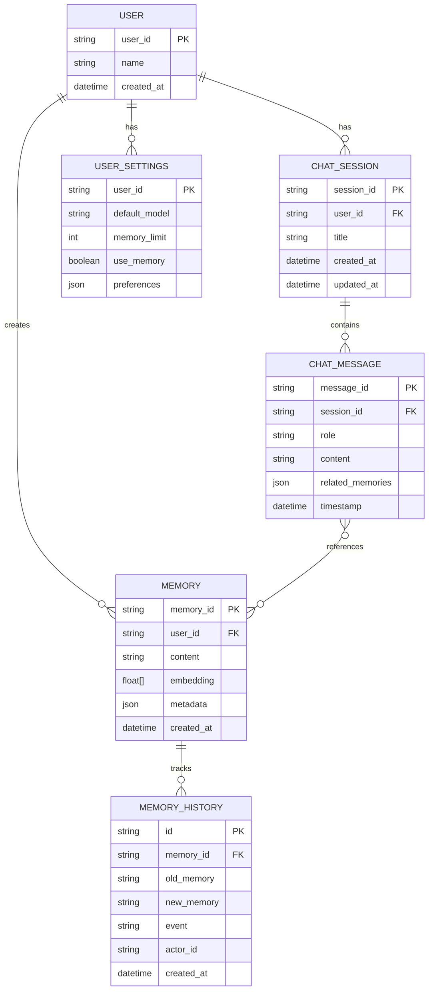

### 4.1 Memory Entry
```python
{
    "memory_id": "uuid",
    "content": "사용자가 저장한 텍스트 내용",
    "user_id": "user123",
    "metadata": {
        "tags": ["personal", "work"],
        "timestamp": "2025-11-05T12:00:00Z",
        "source": "manual_input"
    },
    "embedding": [0.123, 0.456, ...],  # 자동 생성
    "created_at": "2025-11-05T12:00:00Z"
}
```

### 4.2 Chat Message
```python
{
    "message_id": "uuid",
    "role": "user" | "assistant",
    "content": "메시지 내용",
    "user_id": "user123",
    "session_id": "session_abc",
    "timestamp": "2025-11-05T12:00:00Z",
    "related_memories": [  # 사용된 메모리 컨텍스트
        {
            "memory_id": "uuid",
            "content": "관련 메모리",
            "relevance_score": 0.89
        }
    ]
}
```

### 4.3 Ollama Model Info
```python
{
    "name": "llama3.2:latest",
    "size": "3.8GB",
    "modified_at": "2025-11-05T12:00:00Z",
    "details": {
        "format": "gguf",
        "family": "llama",
        "parameter_size": "3B"
    }
}
```

---

## 5. API 설계

### 5.0 API 엔드포인트 맵

```mermaid
graph TB
    FastAPI[FastAPI Server<br/>:8000]

    subgraph "Memory APIs"
        M1[POST /api/memory/add<br/>메모리 추가]
        M2[GET /api/memory/search<br/>메모리 검색]
        M3[GET /api/memory/list<br/>전체 메모리]
        M4[DELETE /api/memory/:id<br/>메모리 삭제]
    end

    subgraph "Chat APIs"
        C1[POST /api/chat<br/>대화 생성]
        C2[GET /api/chat/history<br/>대화 이력]
    end

    subgraph "Ollama APIs"
        O1[GET /api/ollama/models<br/>모델 목록]
        O2[POST /api/ollama/pull<br/>모델 다운로드]
        O3[GET /api/ollama/status<br/>서버 상태]
    end

    subgraph "Utility APIs"
        U1[GET /api/health<br/>헬스체크]
        U2[GET /api/stats<br/>통계]
    end

    FastAPI --> M1
    FastAPI --> M2
    FastAPI --> M3
    FastAPI --> M4
    FastAPI --> C1
    FastAPI --> C2
    FastAPI --> O1
    FastAPI --> O2
    FastAPI --> O3
    FastAPI --> U1
    FastAPI --> U2

    M1 -.->|사용| MemService[Memory Service]
    M2 -.->|사용| MemService
    M3 -.->|사용| MemService
    M4 -.->|사용| MemService

    C1 -.->|사용| ChatService[Chat Service]
    C2 -.->|사용| ChatService

    O1 -.->|사용| OllamaService[Ollama Service]
    O2 -.->|사용| OllamaService
    O3 -.->|사용| OllamaService

    style FastAPI fill:#009688
    style M1 fill:#4CAF50
    style M2 fill:#4CAF50
    style M3 fill:#4CAF50
    style M4 fill:#4CAF50
    style C1 fill:#2196F3
    style C2 fill:#2196F3
    style O1 fill:#FF9800
    style O2 fill:#FF9800
    style O3 fill:#FF9800
    style U1 fill:#9C27B0
    style U2 fill:#9C27B0
```

### 5.1 Memory Management APIs

#### POST /api/memory/add
메모리 추가
```json
Request:
{
    "content": "저장할 텍스트 내용",
    "user_id": "user123",
    "metadata": {
        "tags": ["work", "important"]
    }
}

Response:
{
    "success": true,
    "memory_id": "uuid",
    "message": "Memory added successfully"
}
```

#### GET /api/memory/search
메모리 검색
```json
Request Query Params:
?query=검색어&user_id=user123&limit=10

Response:
{
    "memories": [
        {
            "memory_id": "uuid",
            "content": "관련 메모리 내용",
            "score": 0.89,
            "metadata": {...}
        }
    ],
    "total": 5
}
```

#### GET /api/memory/list
전체 메모리 조회
```json
Request Query Params:
?user_id=user123&limit=50&offset=0

Response:
{
    "memories": [...],
    "total": 120,
    "limit": 50,
    "offset": 0
}
```

#### DELETE /api/memory/{memory_id}
메모리 삭제
```json
Response:
{
    "success": true,
    "message": "Memory deleted successfully"
}
```

### 5.2 Chat APIs

#### POST /api/chat
대화 생성
```json
Request:
{
    "message": "사용자 질문",
    "user_id": "user123",
    "session_id": "session_abc",
    "model": "llama3.2:latest",
    "use_memory": true,  // 메모리 컨텍스트 사용 여부
    "memory_limit": 5    // 사용할 메모리 개수
}

Response:
{
    "response": "AI 응답",
    "related_memories": [
        {
            "memory_id": "uuid",
            "content": "사용된 메모리",
            "score": 0.89
        }
    ],
    "model_used": "llama3.2:latest",
    "timestamp": "2025-11-05T12:00:00Z"
}
```

#### GET /api/chat/history
대화 이력 조회
```json
Request Query Params:
?user_id=user123&session_id=session_abc&limit=50

Response:
{
    "messages": [
        {
            "role": "user",
            "content": "질문",
            "timestamp": "..."
        },
        {
            "role": "assistant",
            "content": "응답",
            "related_memories": [...],
            "timestamp": "..."
        }
    ]
}
```

### 5.3 Ollama Integration APIs

#### GET /api/ollama/models
사용 가능한 모델 목록
```json
Response:
{
    "models": [
        {
            "name": "llama3.2:latest",
            "size": "3.8GB",
            "modified_at": "2025-11-05T12:00:00Z",
            "details": {...}
        }
    ]
}
```

#### POST /api/ollama/pull
새 모델 다운로드
```json
Request:
{
    "model_name": "mistral:latest"
}

Response (Streaming):
{
    "status": "downloading",
    "progress": 45.5,
    "message": "Downloading model..."
}
```

#### GET /api/ollama/status
Ollama 서버 상태 확인
```json
Response:
{
    "status": "online",
    "version": "0.1.20",
    "models_count": 3
}
```

### 5.4 Utility APIs

#### GET /api/health
헬스체크
```json
Response:
{
    "status": "healthy",
    "services": {
        "ollama": "online",
        "vector_db": "online",
        "memory": "online"
    }
}
```

#### GET /api/stats
통계 정보
```json
Response:
{
    "total_memories": 1250,
    "total_conversations": 89,
    "active_users": 5,
    "most_used_model": "llama3.2:latest"
}
```

---

## 6. Frontend 설계

### 6.1 페이지 구조

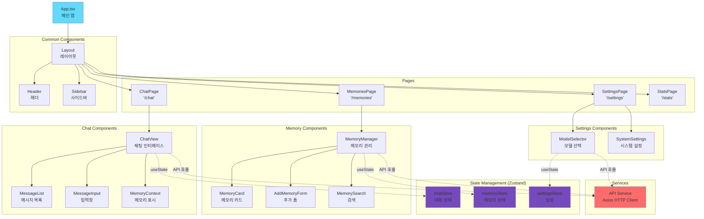

### 6.1.1 라우팅 구조

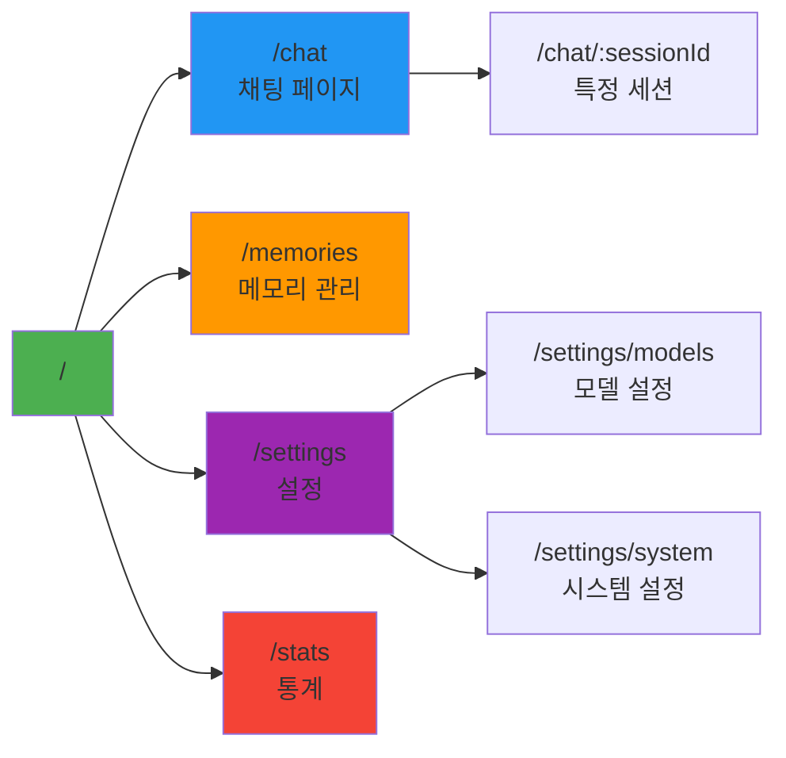

### 6.2 주요 컴포넌트

#### ChatView
```typescript
interface ChatViewProps {
    userId: string;
    sessionId: string;
}

// 기능:
- 메시지 입력 및 전송
- 대화 히스토리 표시
- 사용된 메모리 컨텍스트 표시 (접을 수 있음)
- 스트리밍 응답 지원 (선택적)
- 모델 선택 드롭다운
```

#### MemoryManager
```typescript
interface MemoryManagerProps {
    userId: string;
}

// 기능:
- 새 메모리 추가 (텍스트 입력)
- 메모리 목록 표시 (카드 형태)
- 메모리 검색 (실시간 검색)
- 메모리 삭제/수정
- 태그 필터링
- 메모리 상세 보기
```

#### ModelSelector
```typescript
interface ModelSelectorProps {
    onModelSelect: (model: string) => void;
    currentModel: string;
}

// 기능:
- Ollama 모델 목록 표시
- 모델 정보 (크기, 파라미터 등)
- 현재 선택된 모델 하이라이트
- 새 모델 다운로드 기능
```

#### MemoryContext
```typescript
interface MemoryContextProps {
    memories: Memory[];
    expanded: boolean;
}

// 기능:
- 대화에 사용된 메모리 표시
- 관련도 점수 표시
- 확장/축소 토글
- 메모리 상세 보기 링크
```

### 6.3 UI/UX 특징

1. **실시간 피드백**
   - 메모리 추가 시 즉시 확인 메시지
   - 채팅 응답 로딩 인디케이터
   - 에러 처리 토스트 메시지

2. **반응형 디자인**
   - 모바일/태블릿/데스크톱 지원
   - 다크 모드 지원

3. **접근성**
   - 키보드 네비게이션
   - 스크린 리더 지원
   - ARIA 레이블

---

## 7. 프로젝트 구조

```
mem0-test-program/
├── backend/
│   ├── app/
│   │   ├── __init__.py
│   │   ├── main.py                 # FastAPI 앱 진입점
│   │   ├── config.py               # 설정 관리
│   │   ├── dependencies.py         # 의존성 주입
│   │   ├── api/
│   │   │   ├── __init__.py
│   │   │   ├── memory.py           # Memory API endpoints
│   │   │   ├── chat.py             # Chat API endpoints
│   │   │   ├── ollama.py           # Ollama API endpoints
│   │   │   └── utils.py            # Utility endpoints
│   │   ├── services/
│   │   │   ├── __init__.py
│   │   │   ├── memory_service.py   # mem0 wrapper
│   │   │   ├── ollama_service.py   # Ollama integration
│   │   │   └── chat_service.py     # Chat orchestration
│   │   ├── models/
│   │   │   ├── __init__.py
│   │   │   ├── memory.py           # Pydantic models for memory
│   │   │   ├── chat.py             # Pydantic models for chat
│   │   │   └── ollama.py           # Pydantic models for Ollama
│   │   └── core/
│   │       ├── __init__.py
│   │       ├── exceptions.py       # Custom exceptions
│   │       └── logging.py          # Logging setup
│   ├── tests/
│   │   ├── test_memory.py
│   │   ├── test_chat.py
│   │   └── test_ollama.py
│   ├── requirements.txt
│   ├── pyproject.toml
│   └── Dockerfile
│
├── frontend/
│   ├── public/
│   ├── src/
│   │   ├── components/
│   │   │   ├── Chat/
│   │   │   │   ├── ChatView.tsx
│   │   │   │   ├── MessageList.tsx
│   │   │   │   ├── MessageInput.tsx
│   │   │   │   └── MemoryContext.tsx
│   │   │   ├── Memory/
│   │   │   │   ├── MemoryManager.tsx
│   │   │   │   ├── MemoryCard.tsx
│   │   │   │   ├── MemorySearch.tsx
│   │   │   │   └── AddMemoryForm.tsx
│   │   │   ├── Settings/
│   │   │   │   ├── ModelSelector.tsx
│   │   │   │   └── SystemSettings.tsx
│   │   │   └── Common/
│   │   │       ├── Layout.tsx
│   │   │       ├── Header.tsx
│   │   │       └── Sidebar.tsx
│   │   ├── pages/
│   │   │   ├── ChatPage.tsx
│   │   │   ├── MemoriesPage.tsx
│   │   │   ├── SettingsPage.tsx
│   │   │   └── StatsPage.tsx
│   │   ├── services/
│   │   │   └── api.ts              # API client
│   │   ├── stores/
│   │   │   ├── chatStore.ts
│   │   │   ├── memoryStore.ts
│   │   │   └── settingsStore.ts
│   │   ├── types/
│   │   │   ├── memory.ts
│   │   │   ├── chat.ts
│   │   │   └── ollama.ts
│   │   ├── utils/
│   │   │   └── helpers.ts
│   │   ├── App.tsx
│   │   └── main.tsx
│   ├── package.json
│   ├── vite.config.ts
│   ├── tsconfig.json
│   └── Dockerfile
│
├── docker-compose.yml
├── .env.example
├── README.md
└── DESIGN.md (this file)
```

---

## 8. 핵심 로직 설계

### 8.1 메모리 저장 플로우

#### 시퀀스 다이어그램: 메모리 저장

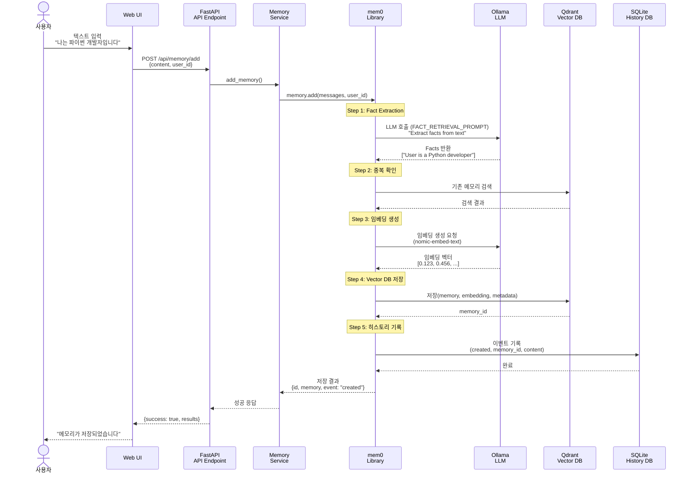

#### 코드 구현

```python
# backend/app/services/memory_service.py

class MemoryService:
    def __init__(self):
        self.memory = Memory(
            config=MemoryConfig(
                llm=LlmConfig(
                    provider="ollama",
                    config={
                        "model": "llama3.2:latest",
                        "base_url": "http://ollama:11434"
                    }
                ),
                embedder=EmbedderConfig(
                    provider="ollama",
                    config={
                        "model": "nomic-embed-text:latest"
                    }
                ),
                vector_store=VectorStoreConfig(
                    provider="qdrant",
                    config={
                        "path": "./qdrant_data",
                        "collection_name": "mem0_memories"
                    }
                ),
                history_db_path="./memory_history.db"
            )
        )

    async def add_memory(
        self,
        content: str,
        user_id: str,
        metadata: dict = None
    ) -> dict:
        """
        메모리 추가
        1. mem0에 텍스트 전달
        2. mem0가 자동으로 fact extraction 수행
        3. 임베딩 생성 및 vector store에 저장
        4. SQLite history에 기록
        """
        result = self.memory.add(
            messages=[{"role": "user", "content": content}],
            user_id=user_id,
            metadata=metadata
        )
        return result

    async def search_memories(
        self,
        query: str,
        user_id: str,
        limit: int = 10
    ) -> list:
        """
        메모리 검색
        1. 쿼리를 임베딩으로 변환
        2. Vector similarity search
        3. 관련도 높은 순으로 정렬
        """
        results = self.memory.search(
            query=query,
            user_id=user_id,
            limit=limit
        )
        return results
```

### 8.2 채팅 플로우 (메모리 통합)

#### 시퀀스 다이어그램: 메모리 기반 질의응답

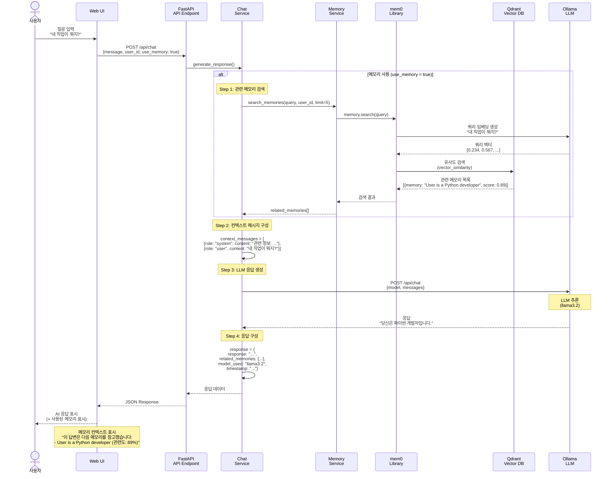

#### 데이터 흐름 비교

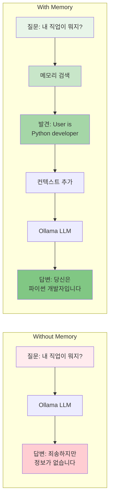

#### 코드 구현

```python
# backend/app/services/chat_service.py

class ChatService:
    def __init__(
        self,
        memory_service: MemoryService,
        ollama_service: OllamaService
    ):
        self.memory_service = memory_service
        self.ollama_service = ollama_service

    async def generate_response(
        self,
        message: str,
        user_id: str,
        model: str,
        use_memory: bool = True,
        memory_limit: int = 5
    ) -> dict:
        """
        메모리 기반 응답 생성
        1. 사용자 메시지로 관련 메모리 검색
        2. 검색된 메모리를 컨텍스트로 추가
        3. Ollama로 응답 생성
        4. 대화 내용을 메모리에 저장 (선택적)
        """
        related_memories = []

        if use_memory:
            # 관련 메모리 검색
            related_memories = await self.memory_service.search_memories(
                query=message,
                user_id=user_id,
                limit=memory_limit
            )

        # 컨텍스트 구성
        context_messages = []

        if related_memories:
            context = "관련 정보:\n"
            for mem in related_memories:
                context += f"- {mem['content']}\n"

            context_messages.append({
                "role": "system",
                "content": context
            })

        # 사용자 메시지 추가
        context_messages.append({
            "role": "user",
            "content": message
        })

        # Ollama로 응답 생성
        response = await self.ollama_service.chat(
            model=model,
            messages=context_messages
        )

        return {
            "response": response["message"]["content"],
            "related_memories": related_memories,
            "model_used": model
        }
```

### 8.3 Ollama 통합

#### Ollama 서비스 아키텍처

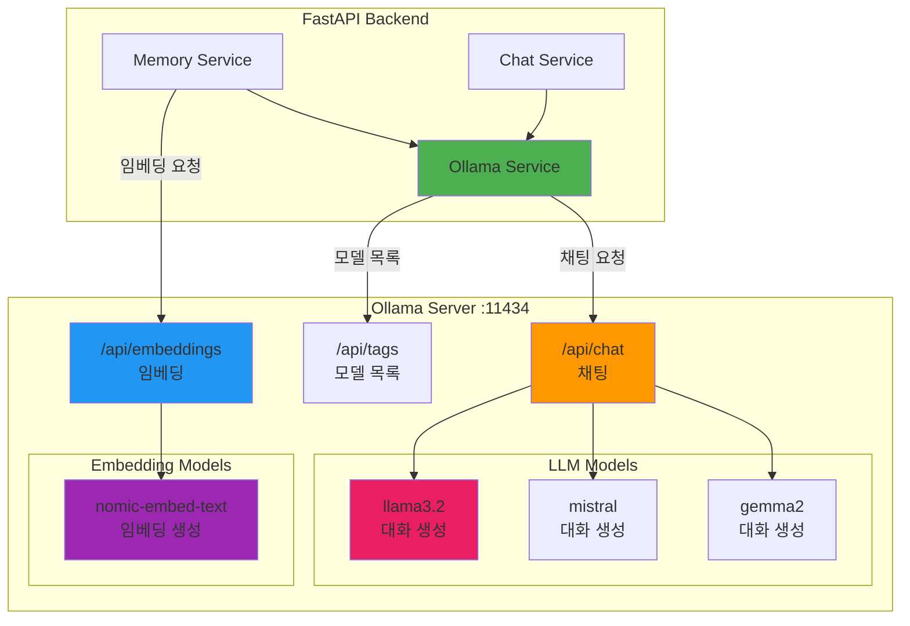

#### Ollama API 호출 시퀀스

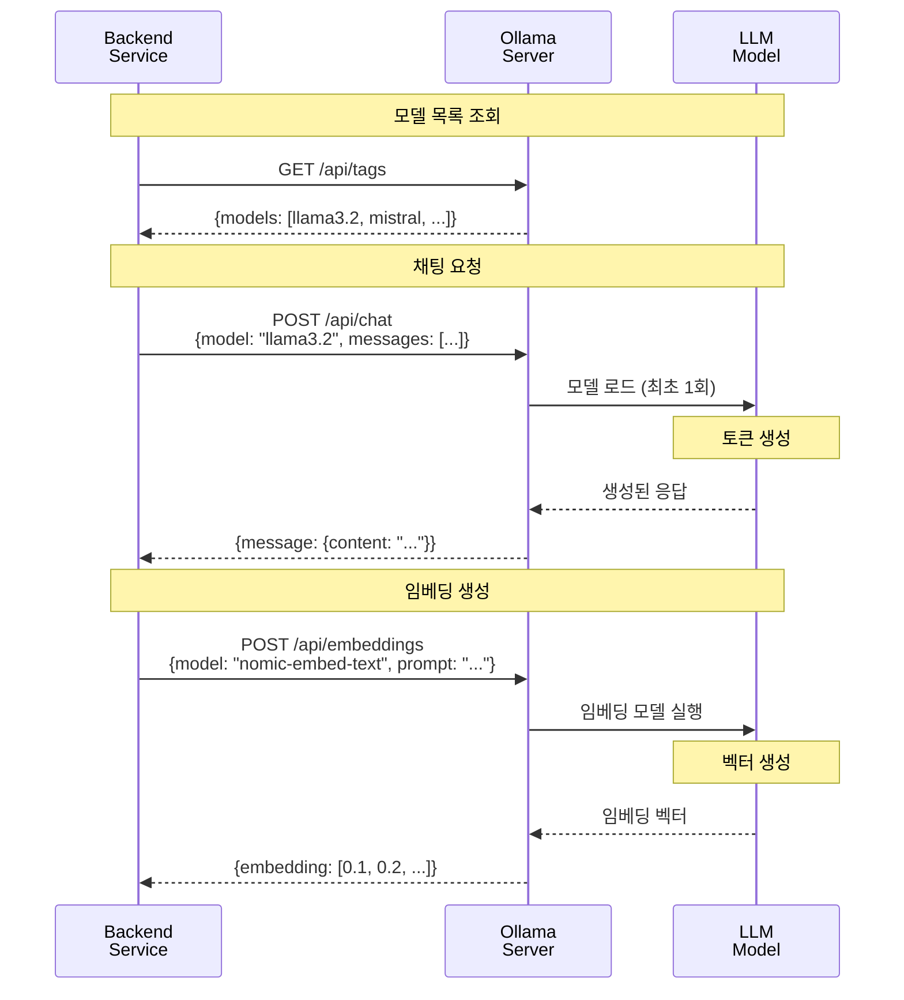

#### 코드 구현

```python
# backend/app/services/ollama_service.py

import httpx

class OllamaService:
    def __init__(self, base_url: str = "http://localhost:11434"):
        self.base_url = base_url
        self.client = httpx.AsyncClient()

    async def list_models(self) -> list:
        """사용 가능한 모델 목록 조회"""
        response = await self.client.get(f"{self.base_url}/api/tags")
        return response.json()["models"]

    async def chat(
        self,
        model: str,
        messages: list,
        stream: bool = False
    ) -> dict:
        """채팅 API 호출"""
        response = await self.client.post(
            f"{self.base_url}/api/chat",
            json={
                "model": model,
                "messages": messages,
                "stream": stream
            }
        )
        return response.json()

    async def check_status(self) -> dict:
        """Ollama 서버 상태 확인"""
        try:
            response = await self.client.get(f"{self.base_url}/api/version")
            return {
                "status": "online",
                "version": response.json()["version"]
            }
        except Exception:
            return {"status": "offline"}
```

---

## 9. 추가 기능 제안

### 9.1 대화 세션 관리
- 세션별 대화 이력 저장
- 세션 간 전환
- 세션 삭제/아카이브

### 9.2 메모리 자동 저장
- 중요한 대화 내용을 자동으로 메모리에 저장
- 사용자 승인 옵션

### 9.3 메모리 태그 시스템
- 메모리에 태그 추가/관리
- 태그별 필터링 및 검색

### 9.4 Export/Import 기능
- 메모리를 JSON/CSV로 내보내기
- 외부 데이터 가져오기

### 9.5 멀티 유저 지원
- 유저별 메모리 격리
- 간단한 인증 시스템

### 9.6 메모리 분석 대시보드
- 가장 많이 참조된 메모리
- 메모리 증가 추세
- 모델별 사용 통계

### 9.7 임베딩 모델 선택
- 다양한 임베딩 모델 지원
- 임베딩 품질 비교

### 9.8 스트리밍 응답
- 실시간 응답 스트리밍
- 사용자 경험 개선

---

## 10. 환경 설정

### 10.1 필수 환경 변수

```bash
# .env
# Backend
BACKEND_PORT=8000
BACKEND_HOST=0.0.0.0

# Ollama
OLLAMA_BASE_URL=http://localhost:11434
OLLAMA_DEFAULT_MODEL=llama3.2:latest

# Mem0
VECTOR_STORE_PATH=./data/qdrant
HISTORY_DB_PATH=./data/memory_history.db
EMBEDDING_MODEL=nomic-embed-text:latest

# Frontend
VITE_API_BASE_URL=http://localhost:8000
VITE_DEFAULT_USER_ID=user123

# Optional
LOG_LEVEL=INFO
CORS_ORIGINS=http://localhost:5173,http://localhost:3000
```

### 10.2 Docker Compose 구성

```yaml
version: '3.8'

services:
  ollama:
    image: ollama/ollama:latest
    ports:
      - "11434:11434"
    volumes:
      - ollama_data:/root/.ollama
    restart: unless-stopped

  backend:
    build: ./backend
    ports:
      - "8000:8000"
    volumes:
      - ./backend:/app
      - mem0_data:/app/data
    environment:
      - OLLAMA_BASE_URL=http://ollama:11434
    depends_on:
      - ollama
    restart: unless-stopped

  frontend:
    build: ./frontend
    ports:
      - "5173:5173"
    volumes:
      - ./frontend:/app
      - /app/node_modules
    environment:
      - VITE_API_BASE_URL=http://localhost:8000
    depends_on:
      - backend
    restart: unless-stopped

volumes:
  ollama_data:
  mem0_data:
```

---

## 11. 개발 로드맵

### Phase 1: 기본 기능 구현 (1-2주)
- [ ] FastAPI 백엔드 기본 구조
- [ ] mem0 통합 및 메모리 CRUD
- [ ] Ollama 통합 및 모델 목록
- [ ] 기본 채팅 API
- [ ] React 프론트엔드 기본 구조
- [ ] 채팅 UI 컴포넌트
- [ ] 메모리 관리 UI

### Phase 2: 고급 기능 (1주)
- [ ] 메모리 검색 최적화
- [ ] 컨텍스트 기반 응답 개선
- [ ] 세션 관리
- [ ] 태그 시스템
- [ ] 스트리밍 응답

### Phase 3: UX 개선 및 부가 기능 (1주)
- [ ] 통계 대시보드
- [ ] Export/Import
- [ ] 다크 모드
- [ ] 반응형 디자인 완성
- [ ] 에러 처리 강화

### Phase 4: 테스트 및 문서화 (3-5일)
- [ ] 단위 테스트 작성
- [ ] 통합 테스트
- [ ] API 문서 (Swagger)
- [ ] 사용자 가이드
- [ ] 배포 가이드

---

## 12. 성능 고려사항

1. **벡터 검색 최적화**
   - Qdrant 인덱스 튜닝
   - 적절한 similarity threshold 설정

2. **응답 시간 개선**
   - 메모리 검색과 LLM 호출 병렬 처리
   - 캐싱 전략

3. **확장성**
   - Qdrant를 외부 서비스로 분리 가능
   - 메모리 분산 저장 고려

4. **리소스 관리**
   - Ollama 모델 메모리 사용량 모니터링
   - 불필요한 모델 언로드

---

## 13. 보안 고려사항

1. **API 보안**
   - CORS 적절히 설정
   - Rate limiting 구현
   - 입력 검증 및 sanitization

2. **데이터 보안**
   - 민감 정보 저장 주의
   - 사용자별 데이터 격리
   - 암호화 고려 (선택적)

3. **인증/인가**
   - 간단한 토큰 기반 인증
   - 사용자 세션 관리

---

## 14. 모니터링 및 로깅

1. **로깅 전략**
   - 구조화된 로깅 (JSON)
   - 로그 레벨 적절히 사용
   - 민감 정보 로그 제외

2. **메트릭 수집**
   - API 응답 시간
   - 메모리 사용량
   - 에러 발생률

3. **헬스체크**
   - Ollama 서버 상태
   - Vector DB 상태
   - 디스크 공간

---

## 결론

이 설계는 mem0와 Ollama를 활용한 실용적인 메모리 기반 대화 시스템의 청사진입니다.
모듈화된 구조로 각 컴포넌트를 독립적으로 개발하고 테스트할 수 있으며,
필요에 따라 기능을 확장하거나 수정할 수 있습니다.

핵심은 mem0의 강력한 메모리 관리 기능과 Ollama의 로컬 LLM을 통합하여
사용자에게 개인화되고 컨텍스트를 이해하는 AI 어시스턴트를 제공하는 것입니다.
