# Mem0 테스트 프로그램 - 추가 시각화 다이어그램

이 문서는 DESIGN.md의 보충 자료로, 추가적인 Mermaid 다이어그램과 시각화를 제공합니다.

---

## 목차
1. [사용자 워크플로우](#1-사용자-워크플로우)
2. [시스템 초기화 시퀀스](#2-시스템-초기화-시퀀스)
3. [에러 처리 플로우](#3-에러-처리-플로우)
4. [Docker 배포 구조](#4-docker-배포-구조)
5. [상태 다이어그램](#5-상태-다이어그램)
6. [전체 데이터 플로우](#6-전체-데이터-플로우)

---

## 1. 사용자 워크플로우

### 1.1 전체 사용자 여정

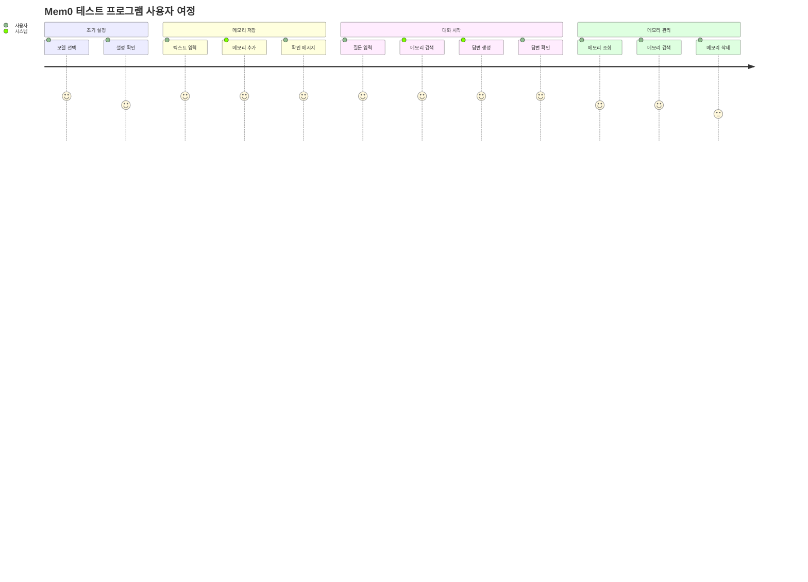
```mermaid
journey
    title Mem0 테스트 프로그램 사용자 여정
    section 초기 설정
      모델 선택: 5: 사용자
      설정 확인: 4: 사용자
    section 메모리 저장
      텍스트 입력: 5: 사용자
      메모리 추가: 5: 시스템
      확인 메시지: 5: 사용자
    section 대화 시작
      질문 입력: 5: 사용자
      메모리 검색: 5: 시스템
      답변 생성: 5: 시스템
      답변 확인: 5: 사용자
    section 메모리 관리
      메모리 조회: 4: 사용자
      메모리 검색: 4: 사용자
      메모리 삭제: 3: 사용자
```

### 1.2 메모리 저장 워크플로우

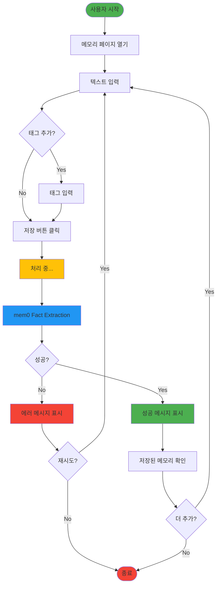
```mermaid
flowchart TD
    Start([사용자 시작]) --> OpenMemory[메모리 페이지 열기]
    OpenMemory --> InputText[텍스트 입력]
    InputText --> AddTags{태그 추가?}
    AddTags -->|Yes| EnterTags[태그 입력]
    AddTags -->|No| ClickSave
    EnterTags --> ClickSave[저장 버튼 클릭]

    ClickSave --> Processing[처리 중...]
    Processing --> mem0[mem0 Fact Extraction]
    mem0 --> Success{성공?}

    Success -->|Yes| ShowSuccess[성공 메시지 표시]
    Success -->|No| ShowError[에러 메시지 표시]

    ShowSuccess --> ViewMemories[저장된 메모리 확인]
    ShowError --> Retry{재시도?}
    Retry -->|Yes| InputText
    Retry -->|No| End

    ViewMemories --> More{더 추가?}
    More -->|Yes| InputText
    More -->|No| End([종료])

    style Start fill:#4CAF50
    style End fill:#F44336
    style Processing fill:#FFC107
    style mem0 fill:#2196F3
    style ShowSuccess fill:#4CAF50
    style ShowError fill:#F44336
```

### 1.3 대화 워크플로우

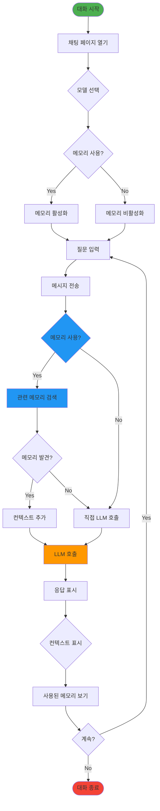
```mermaid
flowchart TD
    Start([대화 시작]) --> ChatPage[채팅 페이지 열기]
    ChatPage --> SelectModel{모델 선택}
    SelectModel --> CheckMemory{메모리 사용?}

    CheckMemory -->|Yes| EnableMemory[메모리 활성화]
    CheckMemory -->|No| DisableMemory[메모리 비활성화]

    EnableMemory --> InputQuestion[질문 입력]
    DisableMemory --> InputQuestion

    InputQuestion --> SendMessage[메시지 전송]
    SendMessage --> SearchMemory{메모리 사용?}

    SearchMemory -->|Yes| FindMemories[관련 메모리 검색]
    SearchMemory -->|No| DirectLLM[직접 LLM 호출]

    FindMemories --> MemFound{메모리 발견?}
    MemFound -->|Yes| AddContext[컨텍스트 추가]
    MemFound -->|No| DirectLLM

    AddContext --> CallLLM[LLM 호출]
    DirectLLM --> CallLLM

    CallLLM --> ShowResponse[응답 표시]
    ShowResponse --> ShowContext{컨텍스트 표시}

    ShowContext --> ViewMemories[사용된 메모리 보기]
    ViewMemories --> Continue{계속?}

    Continue -->|Yes| InputQuestion
    Continue -->|No| End([대화 종료])

    style Start fill:#4CAF50
    style End fill:#F44336
    style SearchMemory fill:#2196F3
    style FindMemories fill:#2196F3
    style CallLLM fill:#FF9800
```

---

## 2. 시스템 초기화 시퀀스

### 2.1 애플리케이션 시작 시퀀스

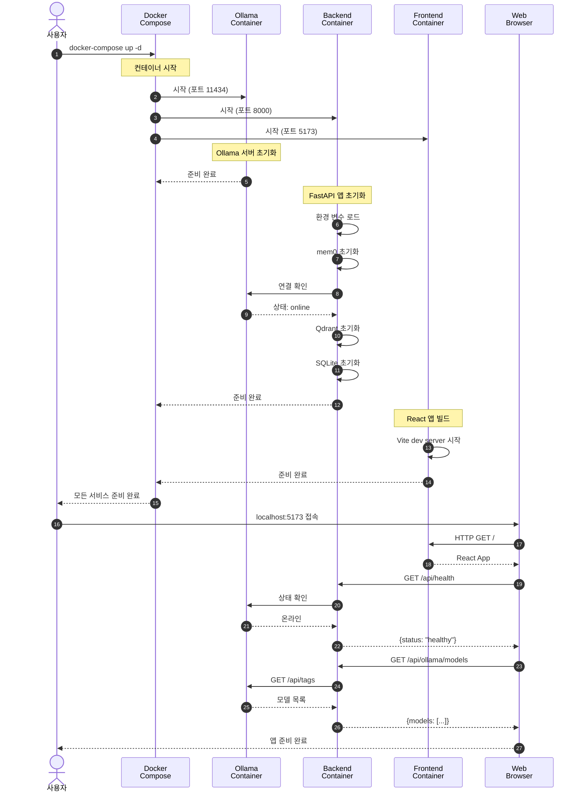
```mermaid
sequenceDiagram
    autonumber
    actor User as 사용자
    participant Docker as Docker<br/>Compose
    participant Ollama as Ollama<br/>Container
    participant Backend as Backend<br/>Container
    participant Frontend as Frontend<br/>Container
    participant Browser as Web<br/>Browser

    User->>Docker: docker-compose up -d

    Note over Docker: 컨테이너 시작
    Docker->>Ollama: 시작 (포트 11434)
    Docker->>Backend: 시작 (포트 8000)
    Docker->>Frontend: 시작 (포트 5173)

    Note over Ollama: Ollama 서버 초기화
    Ollama-->>Docker: 준비 완료

    Note over Backend: FastAPI 앱 초기화
    Backend->>Backend: 환경 변수 로드
    Backend->>Backend: mem0 초기화
    Backend->>Ollama: 연결 확인
    Ollama-->>Backend: 상태: online
    Backend->>Backend: Qdrant 초기화
    Backend->>Backend: SQLite 초기화
    Backend-->>Docker: 준비 완료

    Note over Frontend: React 앱 빌드
    Frontend->>Frontend: Vite dev server 시작
    Frontend-->>Docker: 준비 완료

    Docker-->>User: 모든 서비스 준비 완료

    User->>Browser: localhost:5173 접속
    Browser->>Frontend: HTTP GET /
    Frontend-->>Browser: React App

    Browser->>Backend: GET /api/health
    Backend->>Ollama: 상태 확인
    Ollama-->>Backend: 온라인
    Backend-->>Browser: {status: "healthy"}

    Browser->>Backend: GET /api/ollama/models
    Backend->>Ollama: GET /api/tags
    Ollama-->>Backend: 모델 목록
    Backend-->>Browser: {models: [...]}

    Browser-->>User: 앱 준비 완료
```

### 2.2 mem0 초기화 시퀀스

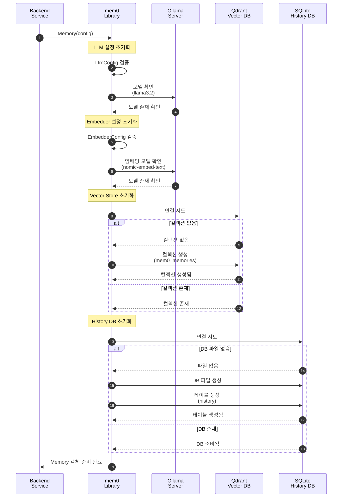
```mermaid
sequenceDiagram
    autonumber
    participant Backend as Backend<br/>Service
    participant Mem0 as mem0<br/>Library
    participant Ollama as Ollama<br/>Server
    participant Qdrant as Qdrant<br/>Vector DB
    participant SQLite as SQLite<br/>History DB

    Backend->>Mem0: Memory(config)

    Note over Mem0: LLM 설정 초기화
    Mem0->>Mem0: LlmConfig 검증
    Mem0->>Ollama: 모델 확인<br/>(llama3.2)
    Ollama-->>Mem0: 모델 존재 확인

    Note over Mem0: Embedder 설정 초기화
    Mem0->>Mem0: EmbedderConfig 검증
    Mem0->>Ollama: 임베딩 모델 확인<br/>(nomic-embed-text)
    Ollama-->>Mem0: 모델 존재 확인

    Note over Mem0: Vector Store 초기화
    Mem0->>Qdrant: 연결 시도
    alt 컬렉션 없음
        Qdrant-->>Mem0: 컬렉션 없음
        Mem0->>Qdrant: 컬렉션 생성<br/>(mem0_memories)
        Qdrant-->>Mem0: 컬렉션 생성됨
    else 컬렉션 존재
        Qdrant-->>Mem0: 컬렉션 존재
    end

    Note over Mem0: History DB 초기화
    Mem0->>SQLite: 연결 시도
    alt DB 파일 없음
        SQLite-->>Mem0: 파일 없음
        Mem0->>SQLite: DB 파일 생성
        Mem0->>SQLite: 테이블 생성<br/>(history)
        SQLite-->>Mem0: 테이블 생성됨
    else DB 존재
        SQLite-->>Mem0: DB 준비됨
    end

    Mem0-->>Backend: Memory 객체 준비 완료
```

---

## 3. 에러 처리 플로우

### 3.1 메모리 저장 에러 처리

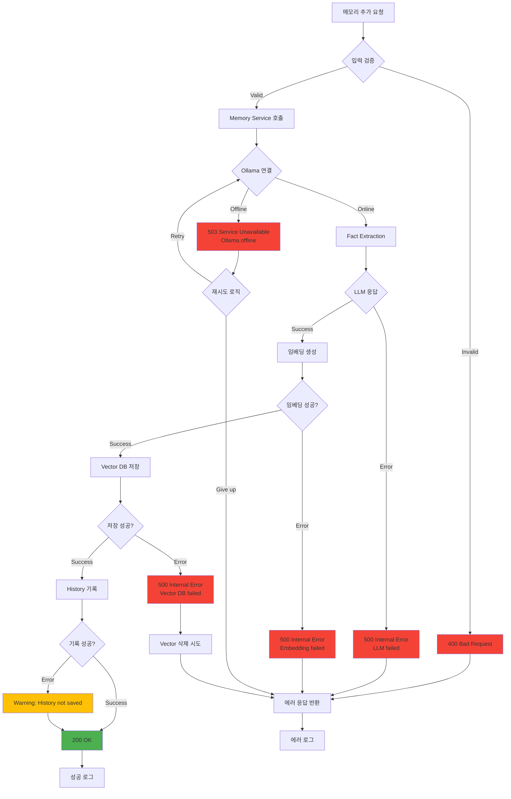
```mermaid
flowchart TD
    Start[메모리 추가 요청] --> ValidateInput{입력 검증}

    ValidateInput -->|Invalid| Error1[400 Bad Request]
    ValidateInput -->|Valid| CallService[Memory Service 호출]

    CallService --> CheckOllama{Ollama 연결}
    CheckOllama -->|Offline| Error2[503 Service Unavailable<br/>Ollama offline]
    CheckOllama -->|Online| FactExtraction[Fact Extraction]

    FactExtraction --> CheckLLM{LLM 응답}
    CheckLLM -->|Error| Error3[500 Internal Error<br/>LLM failed]
    CheckLLM -->|Success| GenerateEmbedding[임베딩 생성]

    GenerateEmbedding --> CheckEmbed{임베딩 성공?}
    CheckEmbed -->|Error| Error4[500 Internal Error<br/>Embedding failed]
    CheckEmbed -->|Success| SaveVector[Vector DB 저장]

    SaveVector --> CheckVector{저장 성공?}
    CheckVector -->|Error| Error5[500 Internal Error<br/>Vector DB failed]
    CheckVector -->|Success| SaveHistory[History 기록]

    SaveHistory --> CheckHistory{기록 성공?}
    CheckHistory -->|Error| Warn[Warning: History not saved]
    CheckHistory -->|Success| Success[200 OK]

    Warn --> Success

    Error1 --> ReturnError[에러 응답 반환]
    Error2 --> RetryCheck{재시도 로직}
    Error3 --> ReturnError
    Error4 --> ReturnError
    Error5 --> Rollback[Vector 삭제 시도]

    RetryCheck -->|Retry| CheckOllama
    RetryCheck -->|Give up| ReturnError

    Rollback --> ReturnError

    Success --> LogSuccess[성공 로그]
    ReturnError --> LogError[에러 로그]

    style Error1 fill:#F44336
    style Error2 fill:#F44336
    style Error3 fill:#F44336
    style Error4 fill:#F44336
    style Error5 fill:#F44336
    style Success fill:#4CAF50
    style Warn fill:#FFC107
```

### 3.2 채팅 에러 처리 시퀀스

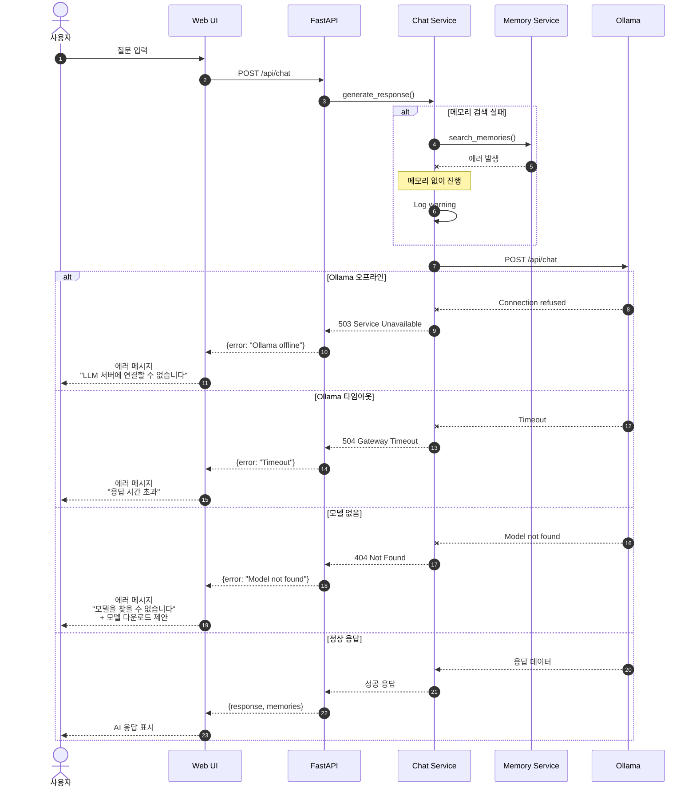
```mermaid
sequenceDiagram
    autonumber
    actor User as 사용자
    participant UI as Web UI
    participant API as FastAPI
    participant ChatService as Chat Service
    participant MemService as Memory Service
    participant Ollama as Ollama

    User->>UI: 질문 입력
    UI->>API: POST /api/chat

    API->>ChatService: generate_response()

    alt 메모리 검색 실패
        ChatService->>MemService: search_memories()
        MemService--xChatService: 에러 발생
        Note over ChatService: 메모리 없이 진행
        ChatService->>ChatService: Log warning
    end

    ChatService->>Ollama: POST /api/chat

    alt Ollama 오프라인
        Ollama--xChatService: Connection refused
        ChatService-->>API: 503 Service Unavailable
        API-->>UI: {error: "Ollama offline"}
        UI-->>User: 에러 메시지<br/>"LLM 서버에 연결할 수 없습니다"
    else Ollama 타임아웃
        Ollama--xChatService: Timeout
        ChatService-->>API: 504 Gateway Timeout
        API-->>UI: {error: "Timeout"}
        UI-->>User: 에러 메시지<br/>"응답 시간 초과"
    else 모델 없음
        Ollama--xChatService: Model not found
        ChatService-->>API: 404 Not Found
        API-->>UI: {error: "Model not found"}
        UI-->>User: 에러 메시지<br/>"모델을 찾을 수 없습니다"<br/>+ 모델 다운로드 제안
    else 정상 응답
        Ollama-->>ChatService: 응답 데이터
        ChatService-->>API: 성공 응답
        API-->>UI: {response, memories}
        UI-->>User: AI 응답 표시
    end
```

### 3.3 전체 에러 흐름

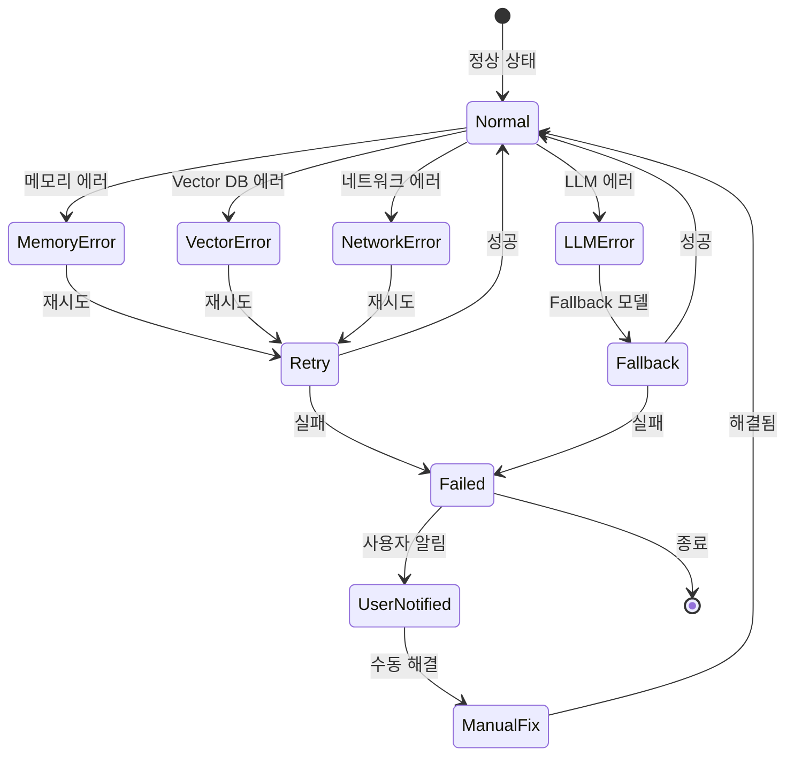
```mermaid
stateDiagram-v2
    [*] --> Normal: 정상 상태

    Normal --> MemoryError: 메모리 에러
    Normal --> LLMError: LLM 에러
    Normal --> VectorError: Vector DB 에러
    Normal --> NetworkError: 네트워크 에러

    MemoryError --> Retry: 재시도
    LLMError --> Fallback: Fallback 모델
    VectorError --> Retry: 재시도
    NetworkError --> Retry: 재시도

    Retry --> Normal: 성공
    Retry --> Failed: 실패

    Fallback --> Normal: 성공
    Fallback --> Failed: 실패

    Failed --> UserNotified: 사용자 알림
    UserNotified --> ManualFix: 수동 해결
    ManualFix --> Normal: 해결됨

    Failed --> [*]: 종료
```

---

## 4. Docker 배포 구조

### 4.1 컨테이너 구조

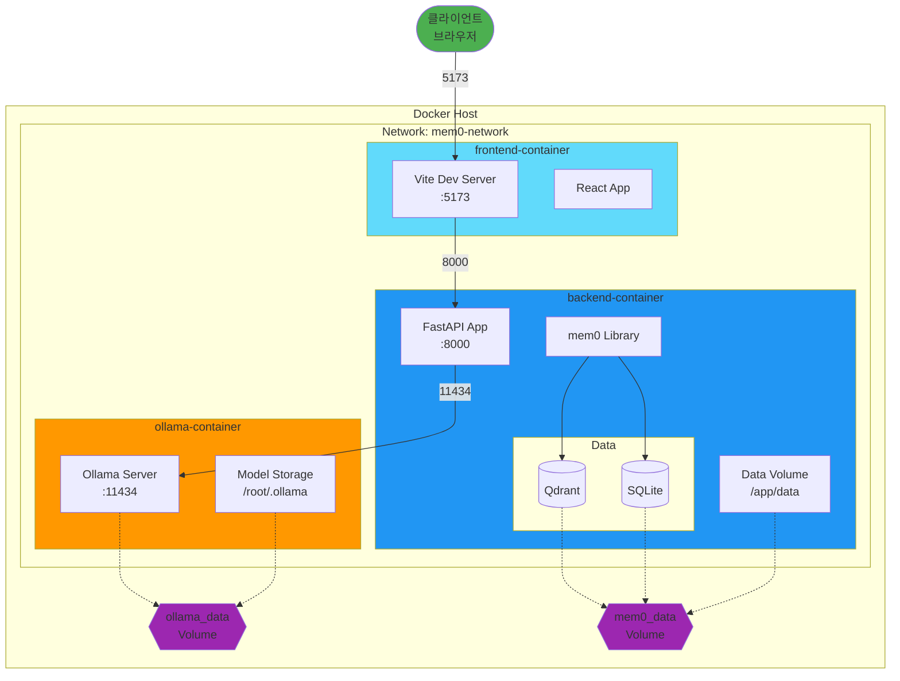
```mermaid
graph TB
    subgraph "Docker Host"
        subgraph "Network: mem0-network"
            subgraph "ollama-container"
                O1[Ollama Server<br/>:11434]
                O2[Model Storage<br/>/root/.ollama]
            end

            subgraph "backend-container"
                B1[FastAPI App<br/>:8000]
                B2[mem0 Library]
                B3[Data Volume<br/>/app/data]
                subgraph "Data"
                    D1[(Qdrant)]
                    D2[(SQLite)]
                end
            end

            subgraph "frontend-container"
                F1[Vite Dev Server<br/>:5173]
                F2[React App]
            end
        end

        V1{{ollama_data<br/>Volume}}
        V2{{mem0_data<br/>Volume}}
    end

    Client([클라이언트<br/>브라우저]) -->|5173| F1
    F1 -->|8000| B1
    B1 -->|11434| O1
    B2 --> D1
    B2 --> D2

    O1 -.-> V1
    O2 -.-> V1
    D1 -.-> V2
    D2 -.-> V2
    B3 -.-> V2

    style Client fill:#4CAF50
    style ollama-container fill:#FF9800
    style backend-container fill:#2196F3
    style frontend-container fill:#61dafb
    style V1 fill:#9C27B0
    style V2 fill:#9C27B0
```

### 4.2 컨테이너 간 통신

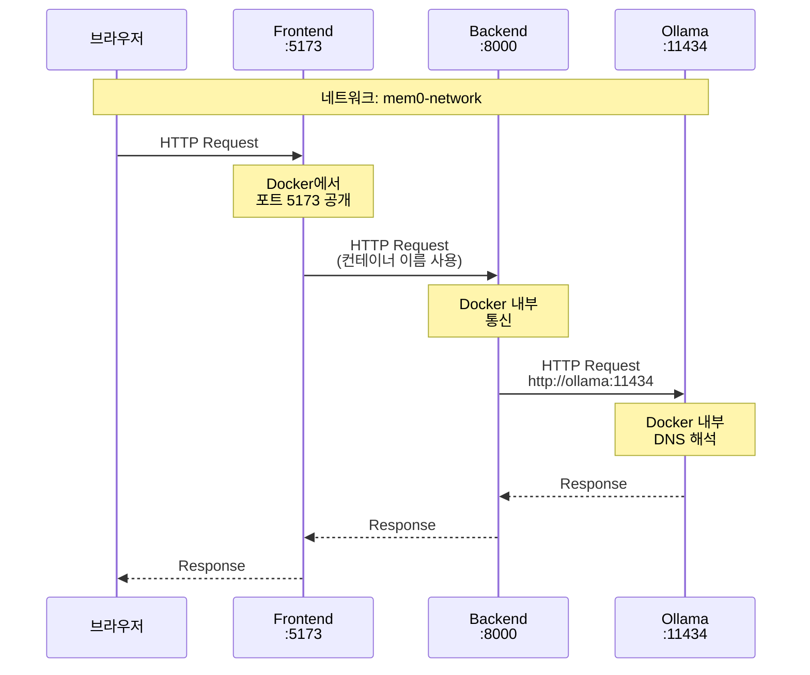
```mermaid
sequenceDiagram
    participant Browser as 브라우저
    participant Frontend as Frontend<br/>:5173
    participant Backend as Backend<br/>:8000
    participant Ollama as Ollama<br/>:11434

    Note over Browser,Ollama: 네트워크: mem0-network

    Browser->>Frontend: HTTP Request
    Note over Frontend: Docker에서<br/>포트 5173 공개

    Frontend->>Backend: HTTP Request<br/>(컨테이너 이름 사용)
    Note over Backend: Docker 내부<br/>통신

    Backend->>Ollama: HTTP Request<br/>http://ollama:11434
    Note over Ollama: Docker 내부<br/>DNS 해석

    Ollama-->>Backend: Response
    Backend-->>Frontend: Response
    Frontend-->>Browser: Response
```

### 4.3 볼륨 마운트 구조

```mermaid
graph LR
    subgraph "Host Machine"
        H1[./backend]
        H2[./frontend]
        H3[./data]
    end

    subgraph "Docker Volumes"
        V1[ollama_data]
        V2[mem0_data]
    end

    subgraph "backend-container"
        B1[/app]
        B2[/app/data]
    end

    subgraph "frontend-container"
        F1[/app]
        F2[/app/node_modules]
    end

    subgraph "ollama-container"
        O1[/root/.ollama]
    end

    H1 -->|bind mount| B1
    H2 -->|bind mount| F1
    H3 -->|bind mount| B2

    V1 -->|volume| O1
    V2 -->|volume| B2

    F2 -.->|anonymous volume| F1

    style H1 fill:#4CAF50
    style H2 fill:#4CAF50
    style H3 fill:#4CAF50
    style V1 fill:#9C27B0
    style V2 fill:#9C27B0
```

### 4.4 배포 프로세스

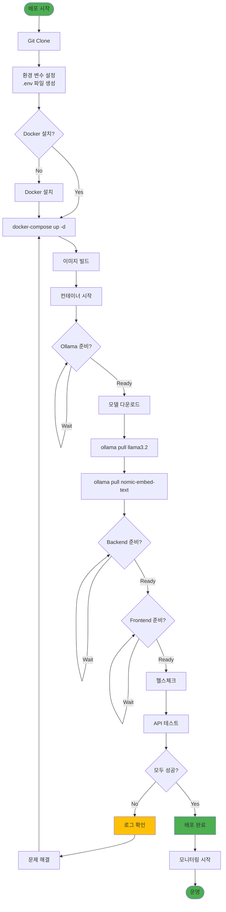
```mermaid
flowchart TD
    Start([배포 시작]) --> Clone[Git Clone]
    Clone --> EnvSetup[환경 변수 설정<br/>.env 파일 생성]

    EnvSetup --> DockerCheck{Docker 설치?}
    DockerCheck -->|No| InstallDocker[Docker 설치]
    DockerCheck -->|Yes| ComposeUp
    InstallDocker --> ComposeUp

    ComposeUp[docker-compose up -d] --> BuildImages[이미지 빌드]
    BuildImages --> StartContainers[컨테이너 시작]

    StartContainers --> OllamaReady{Ollama 준비?}
    OllamaReady -->|Wait| OllamaReady
    OllamaReady -->|Ready| PullModels[모델 다운로드]

    PullModels --> DownloadLLM[ollama pull llama3.2]
    DownloadLLM --> DownloadEmbed[ollama pull nomic-embed-text]

    DownloadEmbed --> BackendReady{Backend 준비?}
    BackendReady -->|Wait| BackendReady
    BackendReady -->|Ready| FrontendReady{Frontend 준비?}

    FrontendReady -->|Wait| FrontendReady
    FrontendReady -->|Ready| HealthCheck[헬스체크]

    HealthCheck --> TestAPI[API 테스트]
    TestAPI --> Success{모두 성공?}

    Success -->|Yes| Complete[배포 완료]
    Success -->|No| Troubleshoot[로그 확인]

    Troubleshoot --> Fix[문제 해결]
    Fix --> ComposeUp

    Complete --> Monitor[모니터링 시작]
    Monitor --> End([운영])

    style Start fill:#4CAF50
    style Complete fill:#4CAF50
    style End fill:#4CAF50
    style Troubleshoot fill:#FFC107
```

---

## 5. 상태 다이어그램

### 5.1 애플리케이션 상태

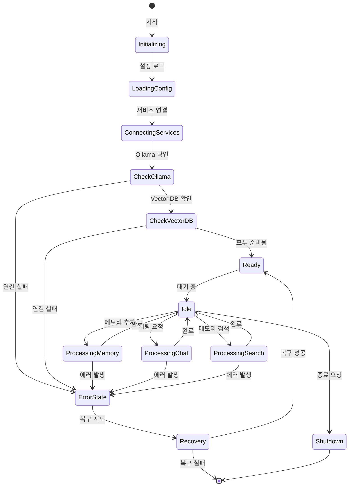
```mermaid
stateDiagram-v2
    [*] --> Initializing: 시작

    Initializing --> LoadingConfig: 설정 로드
    LoadingConfig --> ConnectingServices: 서비스 연결

    ConnectingServices --> CheckOllama: Ollama 확인
    CheckOllama --> CheckVectorDB: Vector DB 확인
    CheckVectorDB --> Ready: 모두 준비됨

    CheckOllama --> ErrorState: 연결 실패
    CheckVectorDB --> ErrorState: 연결 실패

    Ready --> Idle: 대기 중

    Idle --> ProcessingMemory: 메모리 추가
    Idle --> ProcessingChat: 채팅 요청
    Idle --> ProcessingSearch: 메모리 검색

    ProcessingMemory --> Idle: 완료
    ProcessingChat --> Idle: 완료
    ProcessingSearch --> Idle: 완료

    ProcessingMemory --> ErrorState: 에러 발생
    ProcessingChat --> ErrorState: 에러 발생
    ProcessingSearch --> ErrorState: 에러 발생

    ErrorState --> Recovery: 복구 시도
    Recovery --> Ready: 복구 성공
    Recovery --> [*]: 복구 실패

    Idle --> Shutdown: 종료 요청
    Shutdown --> [*]
```

### 5.2 메모리 생명주기

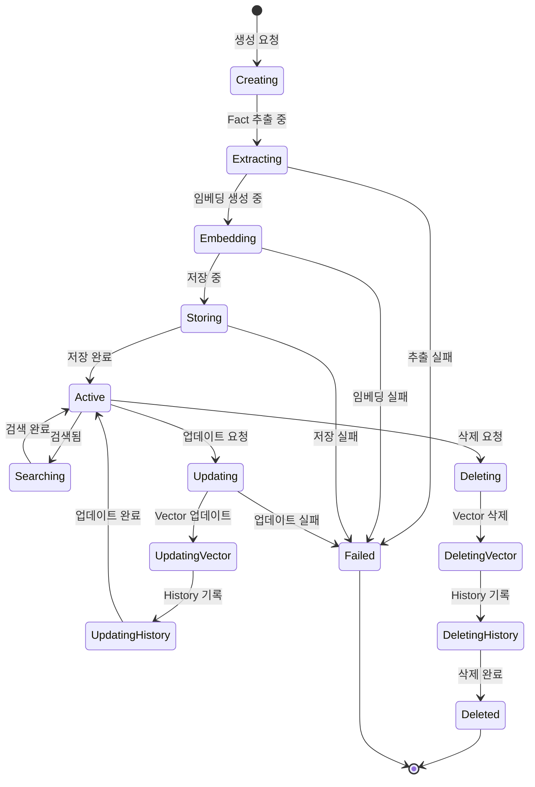
```mermaid
stateDiagram-v2
    [*] --> Creating: 생성 요청

    Creating --> Extracting: Fact 추출 중
    Extracting --> Embedding: 임베딩 생성 중
    Embedding --> Storing: 저장 중

    Storing --> Active: 저장 완료

    Active --> Searching: 검색됨
    Active --> Updating: 업데이트 요청
    Active --> Deleting: 삭제 요청

    Searching --> Active: 검색 완료

    Updating --> UpdatingVector: Vector 업데이트
    UpdatingVector --> UpdatingHistory: History 기록
    UpdatingHistory --> Active: 업데이트 완료

    Deleting --> DeletingVector: Vector 삭제
    DeletingVector --> DeletingHistory: History 기록
    DeletingHistory --> Deleted: 삭제 완료

    Deleted --> [*]

    Extracting --> Failed: 추출 실패
    Embedding --> Failed: 임베딩 실패
    Storing --> Failed: 저장 실패
    Updating --> Failed: 업데이트 실패

    Failed --> [*]
```

### 5.3 채팅 세션 상태

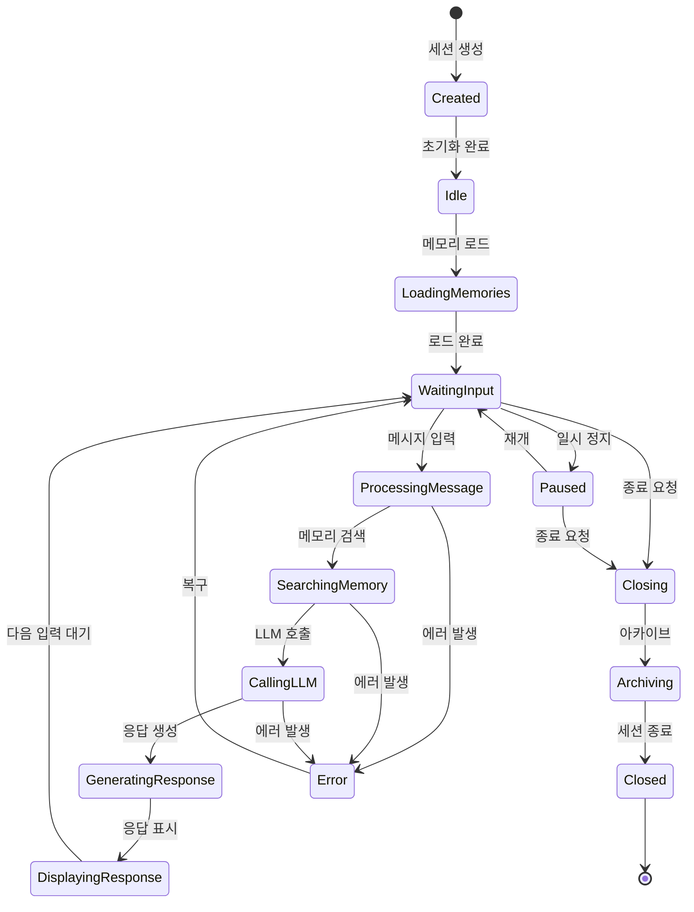
```mermaid
stateDiagram-v2
    [*] --> Created: 세션 생성

    Created --> Idle: 초기화 완료

    Idle --> LoadingMemories: 메모리 로드
    LoadingMemories --> WaitingInput: 로드 완료

    WaitingInput --> ProcessingMessage: 메시지 입력

    ProcessingMessage --> SearchingMemory: 메모리 검색
    SearchingMemory --> CallingLLM: LLM 호출
    CallingLLM --> GeneratingResponse: 응답 생성
    GeneratingResponse --> DisplayingResponse: 응답 표시

    DisplayingResponse --> WaitingInput: 다음 입력 대기

    WaitingInput --> Paused: 일시 정지
    Paused --> WaitingInput: 재개

    WaitingInput --> Closing: 종료 요청
    Paused --> Closing: 종료 요청

    Closing --> Archiving: 아카이브
    Archiving --> Closed: 세션 종료

    Closed --> [*]

    ProcessingMessage --> Error: 에러 발생
    SearchingMemory --> Error: 에러 발생
    CallingLLM --> Error: 에러 발생

    Error --> WaitingInput: 복구
```

---

## 6. 전체 데이터 플로우

### 6.1 엔드투엔드 데이터 흐름

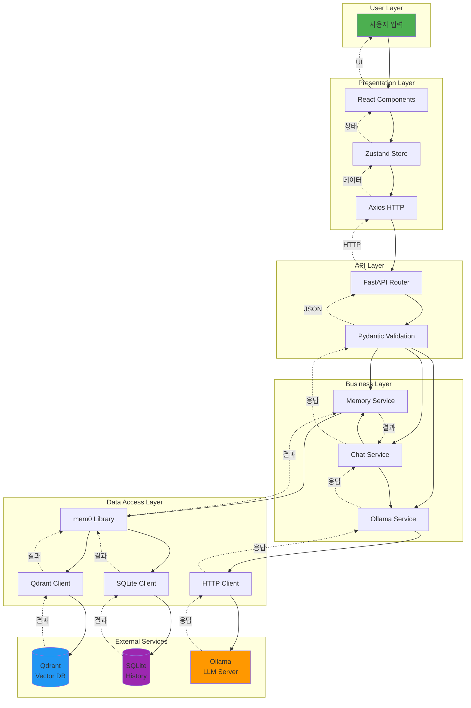
```mermaid
flowchart TB
    subgraph "User Layer"
        U1[사용자 입력]
    end

    subgraph "Presentation Layer"
        P1[React Components]
        P2[Zustand Store]
        P3[Axios HTTP]
    end

    subgraph "API Layer"
        A1[FastAPI Router]
        A2[Pydantic Validation]
    end

    subgraph "Business Layer"
        B1[Memory Service]
        B2[Chat Service]
        B3[Ollama Service]
    end

    subgraph "Data Access Layer"
        D1[mem0 Library]
        D2[Qdrant Client]
        D3[SQLite Client]
        D4[HTTP Client]
    end

    subgraph "External Services"
        E1[(Qdrant<br/>Vector DB)]
        E2[(SQLite<br/>History)]
        E3[Ollama<br/>LLM Server]
    end

    U1 --> P1
    P1 --> P2
    P2 --> P3
    P3 --> A1

    A1 --> A2
    A2 --> B1
    A2 --> B2
    A2 --> B3

    B1 --> D1
    B2 --> B1
    B2 --> B3
    B3 --> D4

    D1 --> D2
    D1 --> D3
    D4 --> E3

    D2 --> E1
    D3 --> E2

    E1 -.->|결과| D2
    E2 -.->|결과| D3
    E3 -.->|응답| D4

    D4 -.->|응답| B3
    D2 -.->|결과| D1
    D3 -.->|결과| D1

    D1 -.->|결과| B1
    B3 -.->|응답| B2
    B1 -.->|결과| B2

    B2 -.->|응답| A2
    A2 -.->|JSON| A1
    A1 -.->|HTTP| P3
    P3 -.->|데이터| P2
    P2 -.->|상태| P1
    P1 -.->|UI| U1

    style U1 fill:#4CAF50
    style E1 fill:#2196F3
    style E2 fill:#9C27B0
    style E3 fill:#FF9800
```

### 6.2 메모리 저장 완전 플로우

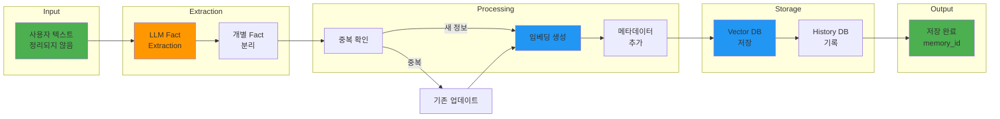
```mermaid
flowchart LR
    subgraph "Input"
        I1[사용자 텍스트<br/>정리되지 않음]
    end

    subgraph "Extraction"
        E1[LLM Fact<br/>Extraction]
        E2[개별 Fact<br/>분리]
    end

    subgraph "Processing"
        P1[중복 확인]
        P2[임베딩 생성]
        P3[메타데이터<br/>추가]
    end

    subgraph "Storage"
        S1[Vector DB<br/>저장]
        S2[History DB<br/>기록]
    end

    subgraph "Output"
        O1[저장 완료<br/>memory_id]
    end

    I1 --> E1
    E1 --> E2
    E2 --> P1
    P1 -->|새 정보| P2
    P1 -->|중복| Update[기존 업데이트]
    Update --> P2
    P2 --> P3
    P3 --> S1
    S1 --> S2
    S2 --> O1

    style I1 fill:#4CAF50
    style E1 fill:#FF9800
    style P2 fill:#2196F3
    style S1 fill:#2196F3
    style O1 fill:#4CAF50
```

### 6.3 질의응답 완전 플로우

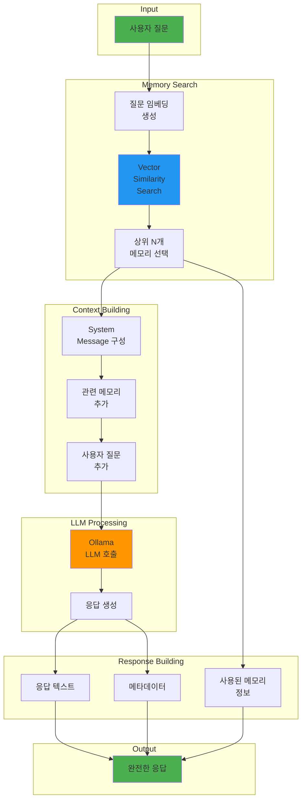
```mermaid
flowchart TB
    subgraph "Input"
        I1[사용자 질문]
    end

    subgraph "Memory Search"
        M1[질문 임베딩<br/>생성]
        M2[Vector<br/>Similarity<br/>Search]
        M3[상위 N개<br/>메모리 선택]
    end

    subgraph "Context Building"
        C1[System<br/>Message 구성]
        C2[관련 메모리<br/>추가]
        C3[사용자 질문<br/>추가]
    end

    subgraph "LLM Processing"
        L1[Ollama<br/>LLM 호출]
        L2[응답 생성]
    end

    subgraph "Response Building"
        R1[응답 텍스트]
        R2[사용된 메모리<br/>정보]
        R3[메타데이터]
    end

    subgraph "Output"
        O1[완전한 응답]
    end

    I1 --> M1
    M1 --> M2
    M2 --> M3
    M3 --> C1
    C1 --> C2
    C2 --> C3
    C3 --> L1
    L1 --> L2
    L2 --> R1
    M3 --> R2
    L2 --> R3
    R1 --> O1
    R2 --> O1
    R3 --> O1

    style I1 fill:#4CAF50
    style M2 fill:#2196F3
    style L1 fill:#FF9800
    style O1 fill:#4CAF50
```

---

## 7. 성능 최적화 전략

### 7.1 캐싱 전략

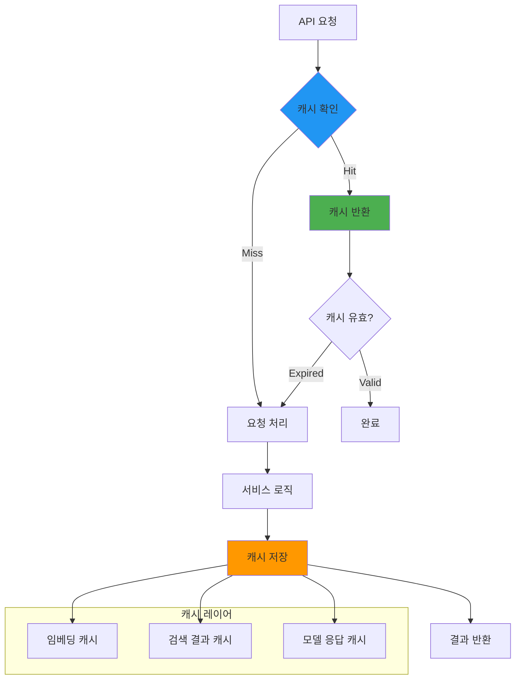
```mermaid
flowchart TB
    Request[API 요청] --> CacheCheck{캐시 확인}

    CacheCheck -->|Hit| ReturnCache[캐시 반환]
    CacheCheck -->|Miss| ProcessRequest[요청 처리]

    ProcessRequest --> SubProcess[서비스 로직]
    SubProcess --> StoreCache[캐시 저장]
    StoreCache --> ReturnResult[결과 반환]

    ReturnCache --> CheckAge{캐시 유효?}
    CheckAge -->|Valid| Done[완료]
    CheckAge -->|Expired| ProcessRequest

    subgraph "캐시 레이어"
        C1[임베딩 캐시]
        C2[검색 결과 캐시]
        C3[모델 응답 캐시]
    end

    StoreCache --> C1
    StoreCache --> C2
    StoreCache --> C3

    style CacheCheck fill:#2196F3
    style ReturnCache fill:#4CAF50
    style StoreCache fill:#FF9800
```

### 7.2 병렬 처리

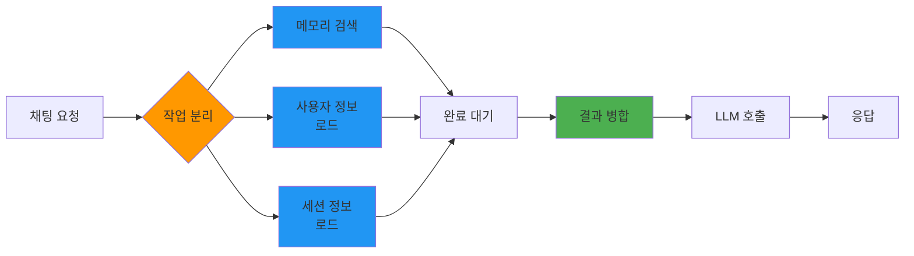
```mermaid
flowchart LR
    Start[채팅 요청] --> Split{작업 분리}

    Split --> Task1[메모리 검색]
    Split --> Task2[사용자 정보<br/>로드]
    Split --> Task3[세션 정보<br/>로드]

    Task1 --> Wait1[완료 대기]
    Task2 --> Wait1
    Task3 --> Wait1

    Wait1 --> Combine[결과 병합]
    Combine --> LLM[LLM 호출]
    LLM --> Response[응답]

    style Split fill:#FF9800
    style Task1 fill:#2196F3
    style Task2 fill:#2196F3
    style Task3 fill:#2196F3
    style Combine fill:#4CAF50
```

---

## 8. 보안 흐름

### 8.1 요청 검증 파이프라인

```mermaid
flowchart TD
    Request[HTTP 요청] --> CORS{CORS 검증}

    CORS -->|Fail| Reject1[403 Forbidden]
    CORS -->|Pass| RateLimit{Rate Limit}

    RateLimit -->|Exceed| Reject2[429 Too Many Requests]
    RateLimit -->|OK| InputValidation{입력 검증}

    InputValidation -->|Invalid| Reject3[400 Bad Request]
    InputValidation -->|Valid| Sanitize[입력 Sanitization]

    Sanitize --> Auth{인증 확인}
    Auth -->|Fail| Reject4[401 Unauthorized]
    Auth -->|Pass| Authorization{권한 확인}

    Authorization -->|Fail| Reject5[403 Forbidden]
    Authorization -->|Pass| Process[요청 처리]

    Process --> Success[200 OK]

    style CORS fill:#FFC107
    style InputValidation fill:#FFC107
    style Auth fill:#FFC107
    style Process fill:#4CAF50
    style Success fill:#4CAF50
```

---

## 9. 모니터링 및 로깅

### 9.1 로깅 흐름

```mermaid
flowchart TB
    Event[이벤트 발생] --> Logger[Logger]

    Logger --> Level{로그 레벨}

    Level -->|DEBUG| Debug[디버그 로그]
    Level -->|INFO| Info[정보 로그]
    Level -->|WARNING| Warning[경고 로그]
    Level -->|ERROR| Error[에러 로그]

    Debug --> Console[콘솔 출력]
    Info --> Console
    Warning --> Console
    Warning --> File[파일 저장]
    Error --> Console
    Error --> File
    Error --> Alert[알림 발송]

    File --> Rotate{파일 크기}
    Rotate -->|Over limit| Archive[아카이브]

    style Error fill:#F44336
    style Warning fill:#FFC107
    style Alert fill:#F44336
```

---

## 결론

이 문서는 DESIGN.md의 보충 자료로, 시스템의 동작을 시각적으로 이해하는 데 도움이 되는 추가 다이어그램을 제공합니다.

각 다이어그램은 Mermaid 형식으로 작성되어 GitHub, GitLab 등 대부분의 Markdown 렌더러에서 자동으로 시각화됩니다.

**주요 다이어그램 요약:**
- 🔄 워크플로우: 사용자 여정 및 작업 흐름
- ⏱️ 시퀀스: 시간 순서에 따른 상호작용
- 🚨 에러 처리: 장애 복구 및 예외 처리
- 🐳 배포: Docker 기반 배포 구조
- 🎯 상태: 애플리케이션 및 데이터 상태 전이
- 📊 데이터: 엔드투엔드 데이터 흐름

모든 다이어그램은 실제 구현과 동기화되어야 하며, 시스템이 변경되면 함께 업데이트되어야 합니다.
