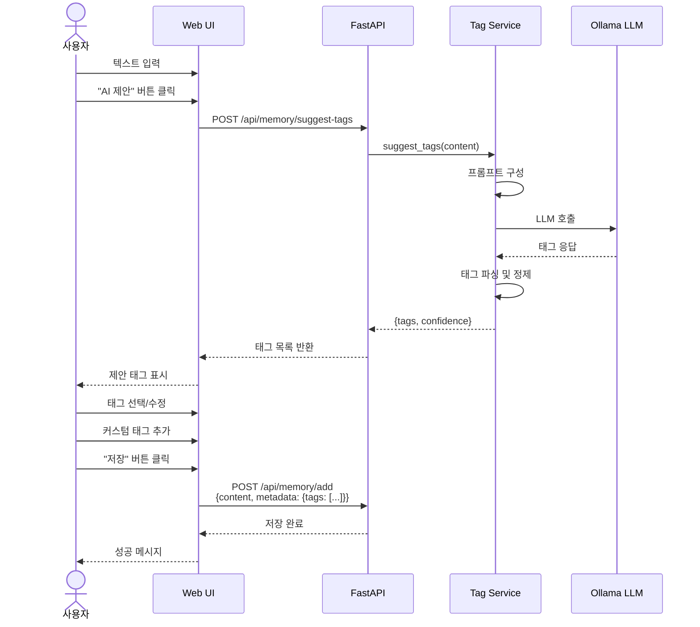

# 태그 자동 생성 기능 가이드 🏷️

mem0 테스트 프로그램의 태그 자동 생성 기능에 대한 상세 가이드입니다.

---

## 목차
1. [기능 개요](#기능-개요)
2. [API 사용법](#api-사용법)
3. [프론트엔드 통합](#프론트엔드-통합)
4. [사용 예시](#사용-예시)
5. [고급 기능](#고급-기능)

---

## 기능 개요

### 🎯 왜 태그 자동 생성이 필요한가?

**문제점**:
- 사용자가 매번 태그를 생각해서 입력하기 어려움
- 일관성 없는 태그 (예: "work", "일", "직장", "업무")
- 중복 태그 발생
- 사용자 경험 저하

**해결책**:
- ✅ **AI 자동 제안**: LLM이 텍스트를 분석하여 적절한 태그 생성
- ✅ **하이브리드 방식**: AI 제안 + 사용자 선택/추가
- ✅ **자동완성**: 기존 태그 재사용으로 일관성 유지
- ✅ **인기 태그**: 자주 사용하는 태그 우선 표시

---

## API 사용법

### 1. 태그 자동 제안

#### Endpoint
```
POST /api/memory/suggest-tags
```

#### Request
```json
{
  "content": "나는 서울에 살고 있고, 파이썬 개발자로 5년째 일하고 있습니다. FastAPI를 주로 사용하고, 최근 머신러닝에 관심이 생겼습니다.",
  "max_tags": 5,
  "language": "ko"
}
```

#### Response
```json
{
  "tags": ["개발", "파이썬", "백엔드", "머신러닝", "서울"],
  "confidence": 0.92
}
```

#### Parameters

| Parameter | Type | Required | Default | Description |
|-----------|------|----------|---------|-------------|
| `content` | string | ✅ Yes | - | 분석할 텍스트 |
| `max_tags` | integer | ❌ No | 5 | 최대 태그 개수 (1-10) |
| `language` | string | ❌ No | "auto" | 태그 언어 ("auto", "ko", "en") |

#### Response Fields

| Field | Type | Description |
|-------|------|-------------|
| `tags` | string[] | 제안된 태그 목록 |
| `confidence` | float | 신뢰도 점수 (0.0-1.0) |

---

### 2. 태그 자동완성

#### Endpoint
```
GET /api/memory/tags/autocomplete?prefix={prefix}&user_id={user_id}
```

#### Request
```
GET /api/memory/tags/autocomplete?prefix=개&user_id=user123&limit=10
```

#### Response
```json
{
  "suggestions": ["개발", "개발자", "개발환경", "개인"]
}
```

---

### 3. 인기 태그 조회

#### Endpoint
```
GET /api/memory/tags/popular?user_id={user_id}
```

#### Request
```
GET /api/memory/tags/popular?user_id=user123&limit=10
```

#### Response
```json
{
  "tags": [
    {
      "tag": "개발",
      "count": 25,
      "last_used": "2025-11-05T12:00:00Z"
    },
    {
      "tag": "파이썬",
      "count": 20,
      "last_used": "2025-11-04T15:30:00Z"
    }
  ],
  "total_tags": 2
}
```

---

## 프론트엔드 통합

### React 컴포넌트 예시

```typescript
import { useState, useEffect } from 'react';
import { memoryApi } from '../services/api';

interface TagInputProps {
  content: string;
  onChange: (tags: string[]) => void;
}

const TagInput: React.FC<TagInputProps> = ({ content, onChange }) => {
  const [suggestedTags, setSuggestedTags] = useState<string[]>([]);
  const [selectedTags, setSelectedTags] = useState<string[]>([]);
  const [customTag, setCustomTag] = useState('');
  const [loading, setLoading] = useState(false);

  // 태그 제안 받기
  const getSuggestions = async () => {
    if (!content || content.length < 10) {
      return;
    }

    setLoading(true);
    try {
      const response = await memoryApi.suggestTags({
        content,
        max_tags: 5,
        language: 'auto'
      });
      setSuggestedTags(response.tags);
    } catch (error) {
      console.error('Failed to get tag suggestions:', error);
    } finally {
      setLoading(false);
    }
  };

  // 태그 토글
  const toggleTag = (tag: string) => {
    const newTags = selectedTags.includes(tag)
      ? selectedTags.filter(t => t !== tag)
      : [...selectedTags, tag];

    setSelectedTags(newTags);
    onChange(newTags);
  };

  // 커스텀 태그 추가
  const addCustomTag = () => {
    if (customTag && !selectedTags.includes(customTag)) {
      const newTags = [...selectedTags, customTag];
      setSelectedTags(newTags);
      onChange(newTags);
      setCustomTag('');
    }
  };

  return (
    <div className="tag-input">
      <div className="flex justify-between items-center mb-2">
        <h3 className="text-sm font-medium">태그</h3>
        <button
          onClick={getSuggestions}
          disabled={loading || !content}
          className="text-blue-600 text-sm"
        >
          {loading ? '분석 중...' : '✨ AI 제안'}
        </button>
      </div>

      {/* AI 제안 태그 */}
      {suggestedTags.length > 0 && (
        <div className="mb-3">
          <p className="text-xs text-gray-500 mb-2">AI 추천 태그:</p>
          <div className="flex flex-wrap gap-2">
            {suggestedTags.map(tag => (
              <button
                key={tag}
                onClick={() => toggleTag(tag)}
                className={`
                  px-3 py-1 rounded-full text-sm
                  ${selectedTags.includes(tag)
                    ? 'bg-blue-600 text-white'
                    : 'bg-gray-100 text-gray-700 hover:bg-gray-200'
                  }
                `}
              >
                {selectedTags.includes(tag) ? '✓ ' : ''}
                {tag}
              </button>
            ))}
          </div>
        </div>
      )}

      {/* 선택된 태그 */}
      {selectedTags.length > 0 && (
        <div className="mb-3">
          <p className="text-xs text-gray-500 mb-2">선택된 태그:</p>
          <div className="flex flex-wrap gap-2">
            {selectedTags.map(tag => (
              <span
                key={tag}
                className="inline-flex items-center px-3 py-1 rounded-full bg-blue-600 text-white text-sm"
              >
                {tag}
                <button
                  onClick={() => toggleTag(tag)}
                  className="ml-2 hover:text-red-300"
                >
                  ×
                </button>
              </span>
            ))}
          </div>
        </div>
      )}

      {/* 커스텀 태그 추가 */}
      <div className="flex gap-2">
        <input
          type="text"
          value={customTag}
          onChange={e => setCustomTag(e.target.value)}
          onKeyPress={e => e.key === 'Enter' && addCustomTag()}
          placeholder="새 태그 추가..."
          className="flex-1 px-3 py-2 border rounded"
        />
        <button
          onClick={addCustomTag}
          disabled={!customTag}
          className="px-4 py-2 bg-gray-600 text-white rounded hover:bg-gray-700"
        >
          추가
        </button>
      </div>
    </div>
  );
};

export default TagInput;
```

### API 클라이언트 (services/api.ts)

```typescript
// 태그 제안
export const memoryApi = {
  suggestTags: async (data: {
    content: string;
    max_tags?: number;
    language?: string;
  }) => {
    const response = await api.post('/api/memory/suggest-tags', data);
    return response.data;
  },

  // 자동완성
  autocompleteTags: async (prefix: string, userId: string, limit = 10) => {
    const response = await api.get('/api/memory/tags/autocomplete', {
      params: { prefix, user_id: userId, limit }
    });
    return response.data;
  },

  // 인기 태그
  getPopularTags: async (userId: string, limit = 10) => {
    const response = await api.get('/api/memory/tags/popular', {
      params: { user_id: userId, limit }
    });
    return response.data;
  }
};
```

---

## 사용 예시

### 예시 1: 개발자 정보

**입력**:
```
나는 서울에 살고 있고, 파이썬 개발자로 5년째 일하고 있습니다.
FastAPI를 주로 사용하고, 최근 머신러닝에 관심이 생겼습니다.
회사는 강남에 있고, 주로 백엔드 API를 개발합니다.
```

**생성된 태그**:
```json
{
  "tags": ["개발", "파이썬", "백엔드", "머신러닝", "서울"],
  "confidence": 0.95
}
```

---

### 예시 2: 회의록

**입력**:
```
2025년 11월 5일 제품 기획 회의

새로운 AI 챗봇 프로젝트에 대해 논의했습니다.
개발 기간은 3개월이며, 기술 스택은 Python, FastAPI, mem0를 사용하기로 했습니다.
예산은 5000만원이고, 김대리가 프로젝트 리더를 맡습니다.
```

**생성된 태그**:
```json
{
  "tags": ["회의", "프로젝트", "ai", "기획", "개발"],
  "confidence": 0.88
}
```

---

### 예시 3: 개인 메모

**입력**:
```
오늘 북한산 등산 갔다 왔다. 날씨가 정말 좋았고,
정상까지 3시간 걸렸다. 다음에는 친구들이랑 같이 가야겠다.
운동화도 새로 사야 할 것 같다.
```

**생성된 태그**:
```json
{
  "tags": ["등산", "북한산", "운동", "취미", "개인"],
  "confidence": 0.92
}
```

---

## 고급 기능

### 1. 태그 계층 구조 (향후 지원)

```
개발
├── 프론트엔드
│   ├── React
│   └── Vue
└── 백엔드
    ├── Python
    │   ├── FastAPI
    │   └── Django
    └── Node.js
```

### 2. 태그 병합 제안

유사한 태그 자동 감지 및 병합 제안:
- "개발", "개발자" → "개발"로 통합 제안
- "python", "파이썬" → "파이썬"으로 통합 제안

### 3. 태그 기반 검색

```
GET /api/memory/search?tags=개발,파이썬&user_id=user123
```

특정 태그를 가진 메모리만 검색

### 4. 태그 클라우드

사용 빈도에 따른 시각화:

```typescript
const TagCloud = ({ userId }) => {
  const [tags, setTags] = useState([]);

  useEffect(() => {
    memoryApi.getPopularTags(userId, 20).then(data => {
      setTags(data.tags);
    });
  }, [userId]);

  return (
    <div className="tag-cloud">
      {tags.map(({ tag, count }) => (
        <span
          key={tag}
          style={{
            fontSize: `${Math.min(10 + count, 24)}px`,
            opacity: Math.min(0.5 + count * 0.05, 1)
          }}
        >
          {tag}
        </span>
      ))}
    </div>
  );
};
```

---

## 워크플로우 다이어그램



---

## 성능 최적화

### 1. 캐싱

- 동일한 텍스트에 대한 태그 제안 캐싱
- 캐시 TTL: 1시간

### 2. 비동기 처리

- 태그 생성을 비동기로 처리하여 UI 블로킹 방지
- 로딩 인디케이터 표시

### 3. 폴백 전략

LLM 실패 시 간단한 키워드 추출로 폴백:
```python
def _fallback_tag_extraction(content, max_tags):
    # 간단한 키워드 빈도 분석
    words = extract_keywords(content)
    return most_common_words(words, max_tags)
```

---

## 트러블슈팅

### 문제 1: 태그가 생성되지 않음

**원인**: Ollama 서버 오프라인

**해결**:
```bash
# Ollama 상태 확인
curl http://localhost:11434/api/version

# Ollama 재시작
ollama serve
```

### 문제 2: 태그 품질이 낮음

**원인**: 텍스트가 너무 짧거나 모호함

**해결**:
- 최소 20자 이상의 텍스트 입력 권장
- 구체적이고 명확한 내용 작성

### 문제 3: 영어/한글 혼재

**원인**: language 파라미터 미지정

**해결**:
```json
{
  "content": "...",
  "language": "ko"  // 명시적으로 언어 지정
}
```

---

## 다음 단계

1. **프론트엔드 통합**: React 컴포넌트 구현
2. **DB 연동**: 태그 통계를 실제 DB에 저장
3. **성능 최적화**: 캐싱 및 배치 처리
4. **고급 기능**: 태그 계층 구조, 병합 제안

---

## 참고 자료

- [DESIGN.md](./DESIGN.md) - 전체 시스템 설계
- [IMPLEMENTATION_GUIDE.md](./IMPLEMENTATION_GUIDE.md) - 구현 가이드
- [API 문서](http://localhost:8000/docs) - Swagger UI

**태그 기능으로 더 나은 메모리 관리 경험을 제공하세요! 🏷️✨**
